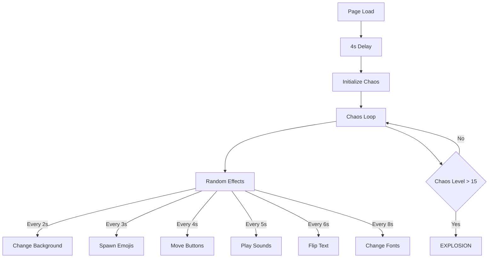
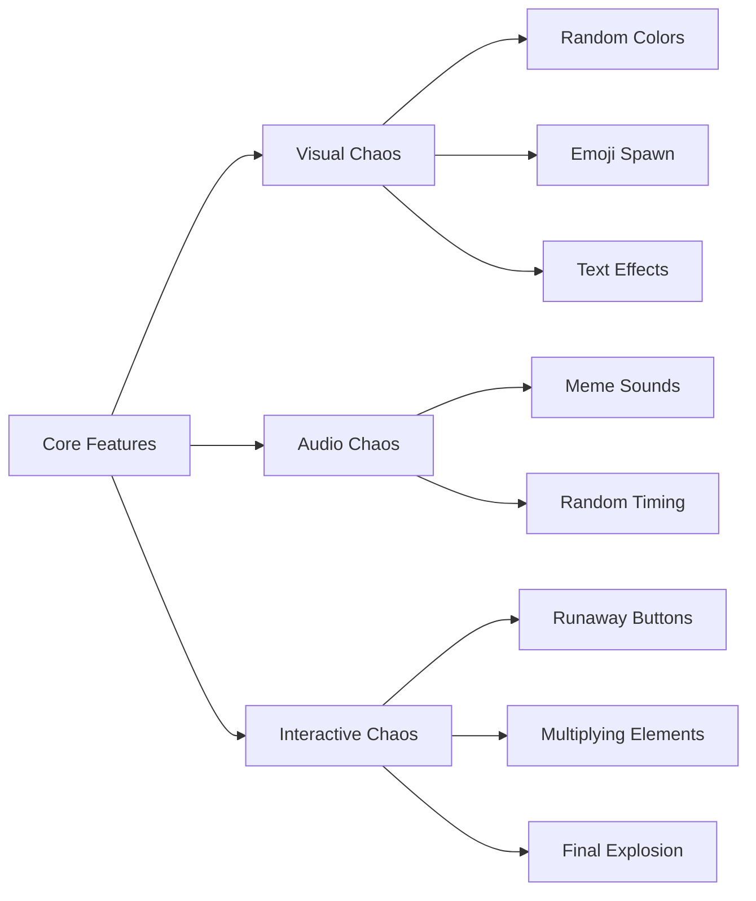

# Falling-Apart 🎯


## Basic Details
### Team Name: 404


### Team Members
- Member 1: Adarsh Menon - SSET
- Member 2: Amal N A - SSET

### Project Description
A completely chaotic and utterly useless 404 error page that gets progressively more unhinged the longer you stay. Features random sounds, multiplying buttons, runaway elements, and eventual system meltdown.

### The Problem (that doesn't exist)
Error pages are too boring and predictable. When users get lost on the internet, they deserve a proper descent into madness, not just a simple "Page Not Found" message. We're solving the critical issue of 404 pages being too sane and professional.

### The Solution (that nobody asked for)
We've created the most chaotic 404 page possible that:
- Shakes and rotates elements randomly 🌀
- Spawns emoji invasions 🫠😵🔥
- Changes fonts to increasingly questionable choices
- Plays random meme sounds 🔊
- Features buttons that run away from your cursor 🏃‍♂️
- Displays increasingly unhinged error messages
- Eventually explodes into complete digital chaos 💥

## Technical Details
### Technologies/Components Used
For Software:
- HTML5 for structure
- CSS for styling and animations
- Vanilla JavaScript for chaos management
- Web Audio API for sound effects
- DOM Manipulation for dynamic content
- CSS Transforms & Animations for visual effects

# Installation
No installation needed! Just clone the repository:
```bash
git clone https://github.com/paracetmwol/404.git
```

# Run
1. Open `index.html` in a web browser
2. Wait 4 seconds for chaos to begin
3. Click the button (if you dare)
4. Watch your sanity slowly disappear
5. Try to survive until the final explosion

### Project Documentation

# Screenshots

*The calm before the storm - A seemingly normal 404 page*


*Peak chaos with multiplying buttons, flying emojis, and glitched text*


*The grand finale - Complete system meltdown*

# Workflow Diagram

*The progression of chaos in our 404 page - From sanity to explosion*

# Features Architecture

*Component breakdown of our chaos system*

### Project Demo
# Video
[Watch the Chaos Unfold](https://youtu.be/your-video-id)
*A full demonstration of our 404 page's descent into madness*

# Features Showcase
1. **Progressive Chaos System**
   - Starts innocently
   - Gradually increases intensity
   - Culminates in total system failure

2. **Interactive Elements**
   - Self-duplicating buttons
   - Cursor-avoiding elements
   - Random sound triggers

3. **Visual Effects**
   - Random color transitions
   - Emoji rain
   - Text transformations
   - Font chaos
   - Giant quote bombs

4. **Audio Experience**
   - Random meme sounds
   - Increasing frequency
   - Chaos-synchronized effects

# Easter Eggs
- Try hovering over buttons multiple times
- Wait for rare special quotes
- Discover unique sound combinations
- Find hidden emoji combinations
- Stay until the very end for the ultimate chaos

---
Made with ❤️ at TinkerHub Useless Projects 


